# Taller practico de disponibilidad y desempeño

### STATEMENT

You have been hired to train a group of engineers in the implementation of high performance and elastic solutions. For this you must build a tutorial that allows them to build and demonstrate the auto-scaling capabilities of Amazon Web Services.

Build a workshop that allows engineers to create a self-scaling solution in EC2 and in which they can demonstrate that the system effectively scales under given load conditions.

## PRE-REQUISITES

* Java jdk > 7
* Git
* Spark

## BUILT

* [JAVA JDK 8](http://www.oracle.com/technetwork/java/javase/overview/index.html) - Building
* [JUnit 3.8.1](https://mvnrepository.com/artifact/junit/junit/3.8.1) - Test
* [SPARK 2.9.1](http://sparkjava.com/download) - Web

# START

Copy the project through git clone in any direction to start working:
```
git clone https://github.com/Juaco9502/Taller-practico-de-Disponibilidad-y-Desempeno---AREP.git
```

## STEPS

### 1. This is an interesting problem that needs a distributed solution and requires high processing consumption, for example string ordering, indexing large amounts of text, etc. Generate the minimum requirements.
### 2. Build a prototype of the solution.

The chosen problem is the ordering of strings, there is a web service which is in charge of ordering the strings that are entered.

The problem with this service is that when there are many requests, you cannot respond to all of them. This for lack of processing. For this reason, it is required that when the requests exceed the capacity of the server, a new instance is created to support these requests.

The solution prototype was built using spark. As can be seen in the image, there is an interface where the user can enter the list of strings to be ordered alphabetically.


### 3. Deploy the solution on AWS on EC2.

This is the deployment process on an EC2 machine:


### 4. Configure the machine to start services after the server restarts.


To configure the service to start with the machine, use "systemd" which is a tool developed by Red Hat that allows
start and stop machine services.

* The service must first be created:


**The ExecStart variable indicates the process to run, you can use a .sh script or simply indicate the command to execute.**

* After this you must copy this file to the address **/ etc / systemd / system /** and grant it execution permissions.


**We can notice that the state of the program is running in the background.**

### 4. Configure the machine to start services after the server restarts.

* If we want it to be executed every time the machine starts, we simply have to execute the following command:

```
sudo systemctl enable myservice
``` 

* When executing the command, the following happens:


* Now we restart the machine and we can see that the status of the service should be "running"


### 5. Create an AMI from this machine.

* Create an image of our machine:

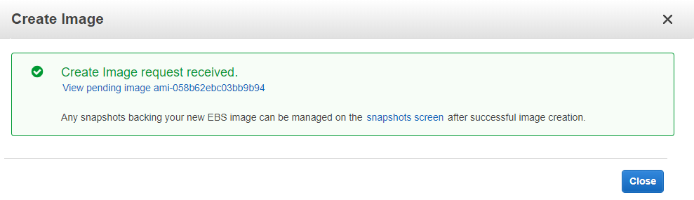

* Template creation and choose the image that we create of our EC2 machine:

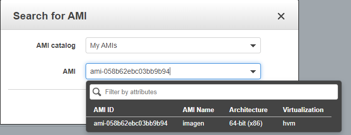

* Configure the id of the AMI, we select amazon linux 2 since it is the free service. We select the type of EC2 instance which
It is t2.micro and finally we choose the keys to access the machine.

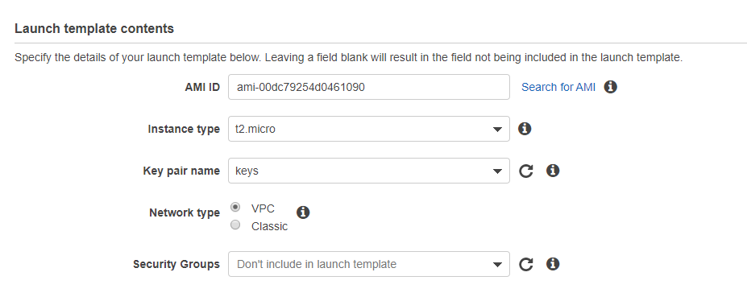

* Configure the vpc:

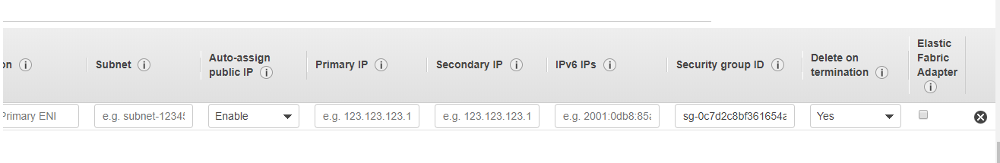

* Finally, finish the creation of the template.

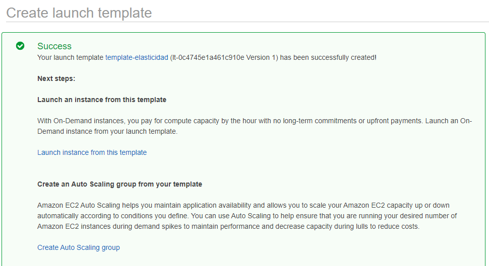

* Launch creation and configuration, initially chose the AMI:

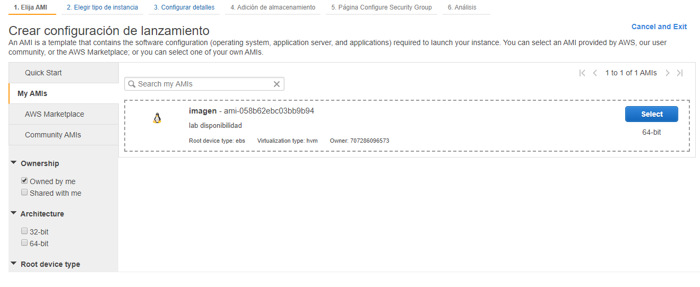

* Choose the type of instance, in our case it is t2 micro.

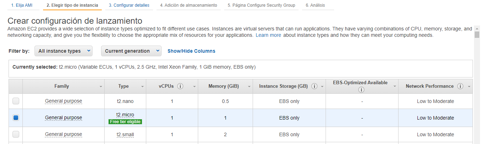

* Configure the launch to assign a public ip to each instance

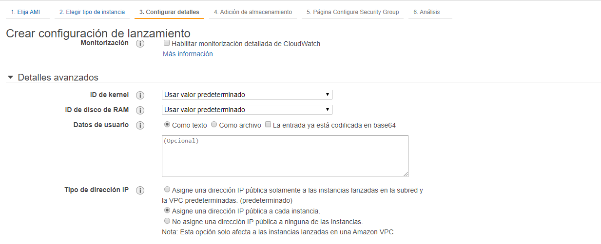


* Now, in review we select the option to edit security groups, this to indicate the ports through which our application will be accessed

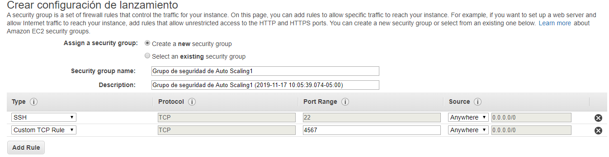

* Select analysis and then create launch configuration. **(Here we must choose the keys that we use to access the EC2 machine)**

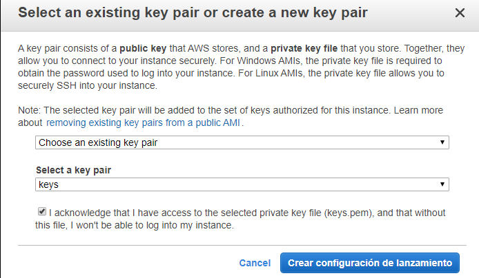

### 6. Deploy the solution in an autoscaling group

* Create the autoscaling group:

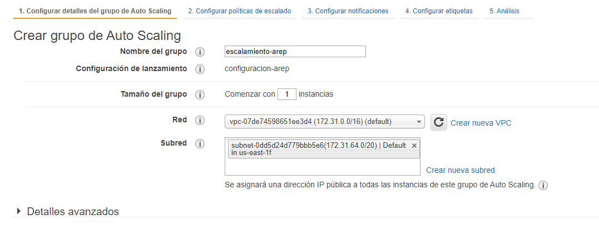

* Configure the scaling policy so that when the CPU consumption exceeds 75% a new instance is created. 

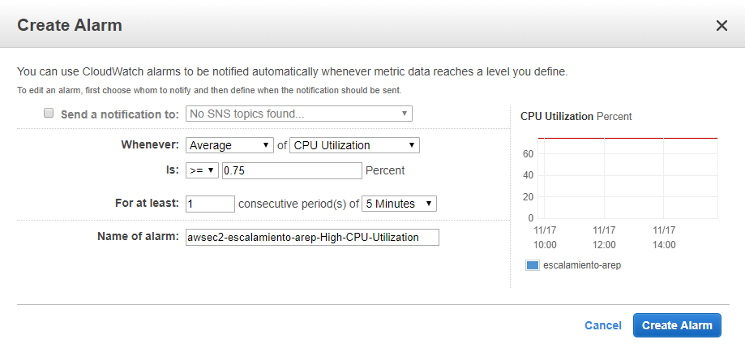

* Added an alarm to reduce the size of the instances when the CPU consumption is below 25% for 5 minutes.

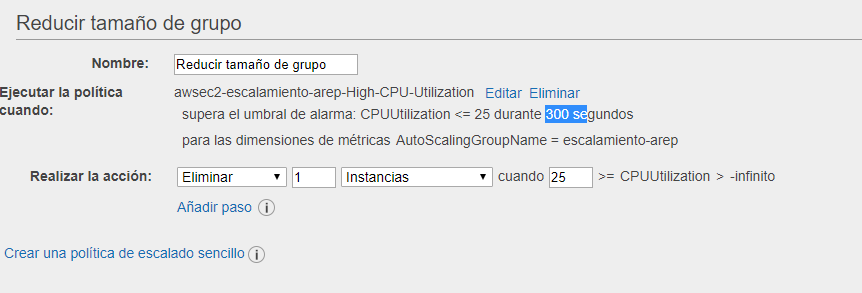

* Create the escalation group:

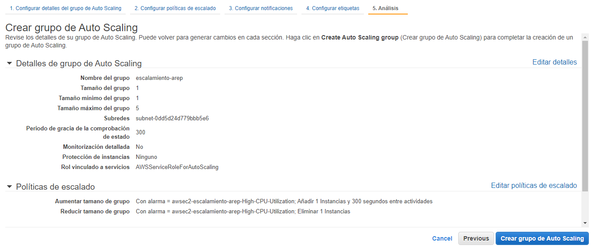

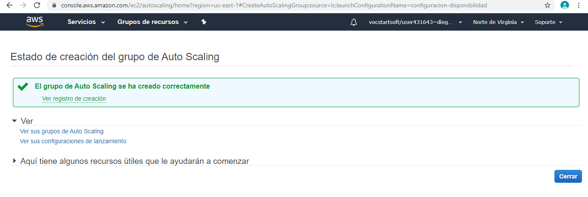

### 8. Monitor and verify that more instances are created.

* run an instance of our machine as can be seen in the image:

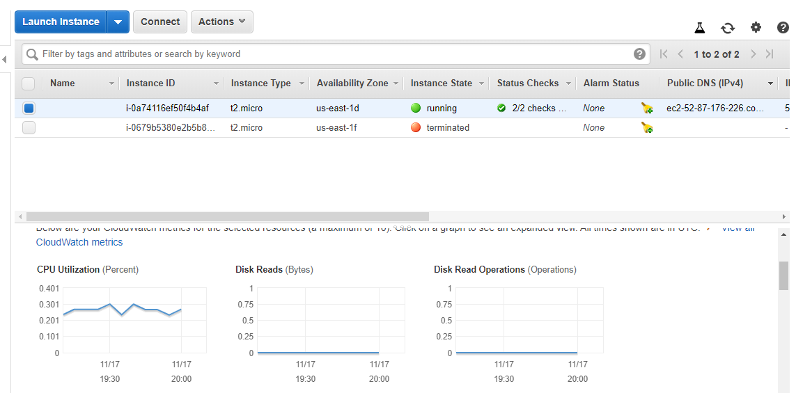

* Send requests and wait for a new instance to be created.

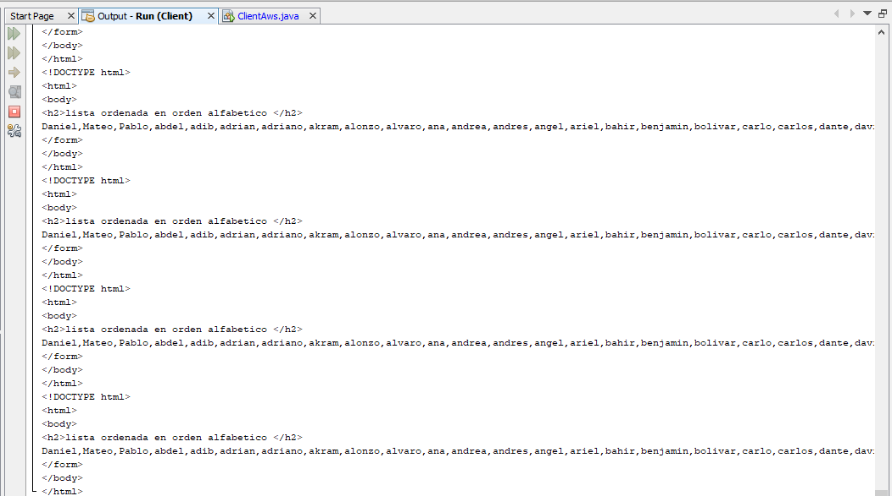

* And as expected, a new instance of our machine is created by exceeding the CPU usage limit, which is 75%.

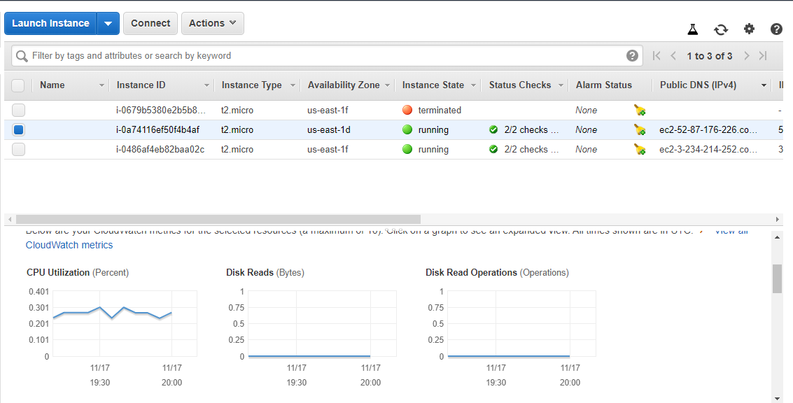

* If monitor the performance of the first machine we can see that effectively the use of cpu reaches that percentage and there a new instance is created.

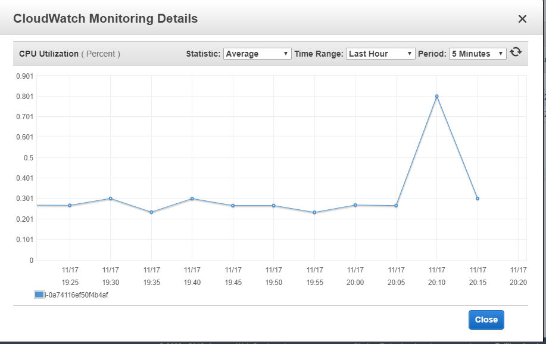

## AUTHOR

**JUAN CAMILO ORTIZ MEDINA** - [Juaco9502](https://github.com/juaco9502)


## LICENSE

This project is licensed under the GNU General Public License - [LICENSE](LICENSE) 